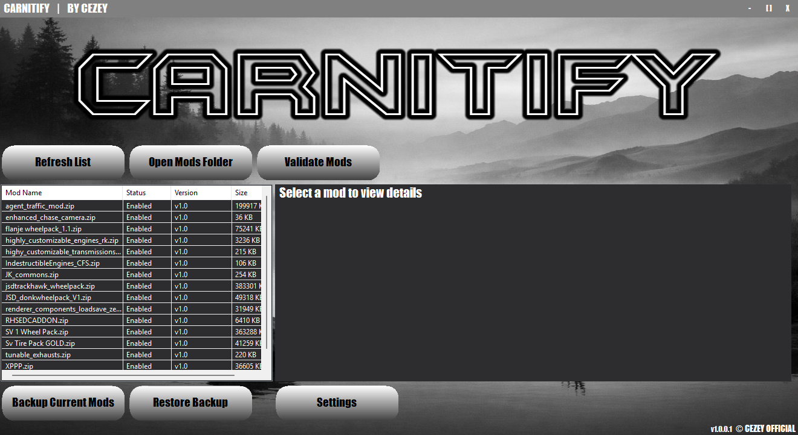

# Carnitify - A BeamNG Mod Manager
A mod manager for BeamNG.drive with multiple features. 

__(all of mods will show v1.0, i will not implement auto-update mods because some of you and me use paid mods or mods that aren't in the official beamng site, so i will not allow piracy, it will remain like this)__

## ⚙️ Features
- Auto-Mod folder scanning
- Backup current mods
- Restore Backup
- Refresh list
- Open mods folder
- Enable/Disable/Delete a specific mod
- Mod details
- Validate Mods (checks for corrupted zip files, duplicates, etc)
- Auto-check for updates on startup (in Settings menu)
- Custom Mods Folder/Path (in Settings menu)
- UI Theme: **Dark**, **Light** (in Settings menu)

